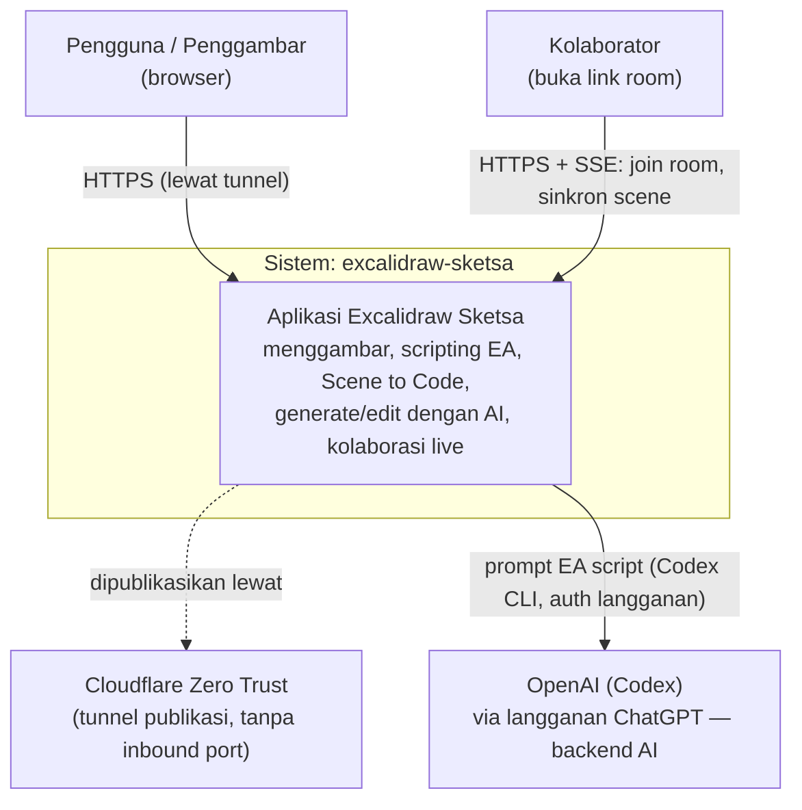
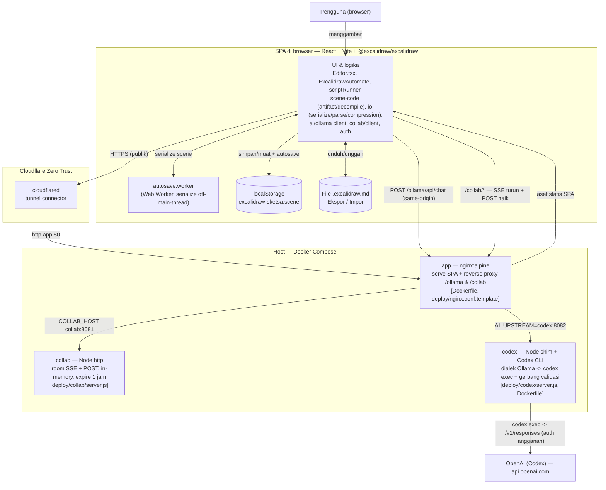

# Arsitektur — excalidraw-sketsa (C4)

Diagram arsitektur dengan model **C4** (Context → Container). Ditulis sebagai Mermaid
`flowchart` sehingga:

- ter-render langsung di GitHub, dan
- bisa dimuat ke kanvas lewat panel **Script** dengan `await ea.addMermaid(\`...\`)`
  (flowchart menjadi shape editable; tiap `subgraph` menjadi frame).

Legenda C4: **Person** = pengguna, **System** = batas sistem kita, **Container** = unit yang
bisa dijalankan/di-deploy (SPA browser, proses nginx, server Node, model), **External System**
= pihak ketiga.

---

## Level 1 — System Context

Siapa memakai sistem, dan sistem eksternal apa yang disentuh.



Catatan: backend AI = **`codex`** (Codex CLI + langganan ChatGPT) di balik shim dialek-Ollama,
dengan gerbang validasi script di sisi server. Lihat
[ADR 0001](adr/0001-codex-cli-subscription-backend.md).

---

## Level 2 — Container

Unit yang bisa dijalankan dan jalur komunikasinya. Batas `Docker Compose` = yang di-deploy
di host; `SPA di browser` = yang jalan di perangkat pengguna.



Catatan jalur:
- **`app` hanya container yang publik** (lewat `cloudflared`); `collab` dan `codex` tidak pernah
  membuka host port — hanya dijangkau via nginx di jaringan compose.
- Browser **selalu** memanggil same-origin `/ollama/*` (nama *dialek/kontrak*, bukan produk
  Ollama) dan `/collab/*`. `src/ai/ollama.ts` tetap sumber tunggal system-prompt EA.
- `codex` di-autentikasi **sekali** via `codex login --device-auth` (kredensial persist di
  volume `/codex-home`). Lihat [ADR 0001](adr/0001-codex-cli-subscription-backend.md).

---

## Container → sumber kode

| Container | Teknologi | Berkas utama |
|---|---|---|
| SPA (browser) | React 18, Vite 6, TypeScript, `@excalidraw/excalidraw` | `src/` (`Editor.tsx`, `automate/`, `scene-code/`, `io/`, `ai/`, `collab/`, `auth/`) |
| autosave.worker | Web Worker | `src/workers/autosave.worker.ts` |
| app | nginx:alpine (multi-stage build) | `Dockerfile`, `deploy/nginx.conf.template` |
| collab | Node `http` | `deploy/collab/server.js`, `deploy/collab/Dockerfile` |
| codex | Node shim (zero-dep) + Codex CLI | `deploy/codex/server.js`, `deploy/codex/Dockerfile` |
| cloudflared | Cloudflare tunnel | `docker-compose.yml` |
| Orkestrasi | Docker Compose (profile `scale` opsional utk redis) | `docker-compose.yml`, `.env` |

## Penyimpanan data

| Data | Tempat | Sifat |
|---|---|---|
| Scene aktif | `localStorage` (`excalidraw-sketsa:scene`) | per-browser, auto-save, hilang bila storage dibersihkan |
| Backup/portabel | File `*.excalidraw.md` (Ekspor/Impor) | format meniru plugin Obsidian; gambar inline |
| Room kolaborasi | Memori `collab` server | in-memory, expire 1 jam setelah user terakhir keluar (tak persisten) |
| Pengetahuan repo | `.nudge/learned/*.md` | catatan insiden/keputusan untuk agent |

## Dev vs Produksi

- **Produksi:** SPA statis di-serve `nginx`; reverse proxy `/ollama` & `/collab` di
  `deploy/nginx.conf.template`; publik lewat `cloudflared`.
- **Dev (`npm run dev`, :8080):** Vite dev server yang mem-proxy `/ollama` ke
  `http://localhost:11434` (`vite.config.ts`). Catatan: backend produksi kini `codex` (bukan
  Ollama on-host), tapi kontrak path `/ollama/*` tetap sama, jadi proxy dev tak perlu berubah.

## Memuat diagram ini ke kanvas

Tempel salah satu blok Mermaid di atas ke panel **Script** lalu jalankan:

```js
await ea.addMermaid(`flowchart TB
  user["Pengguna (browser)"] --> spa["SPA"]
  spa --> app["app (nginx)"]
  app --> collabsrv["collab"]
  app --> codexsvc["codex (Codex CLI)"]`);
await ea.addElementsToView();
```
