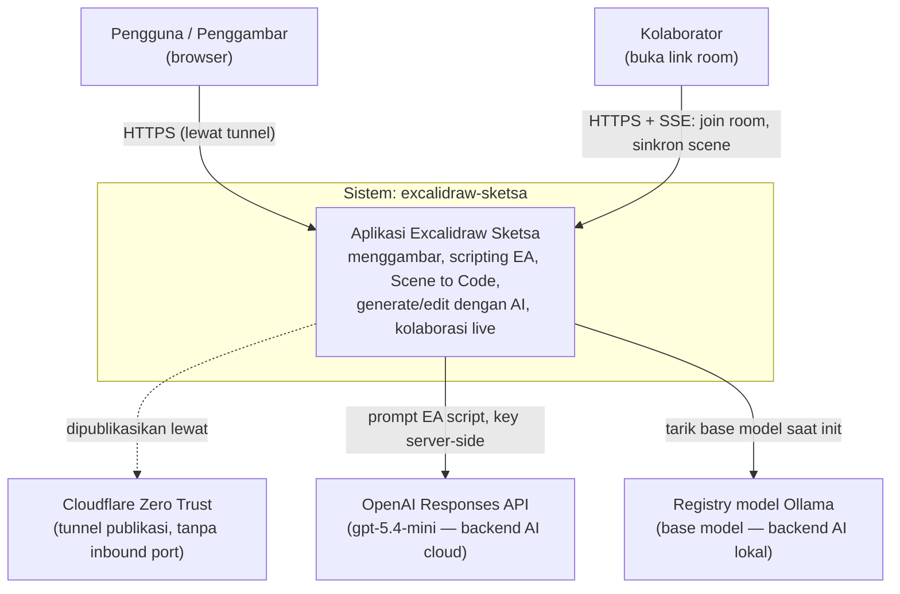
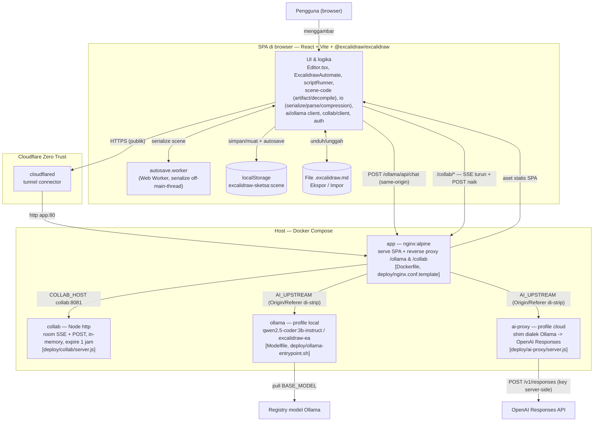

# Arsitektur — excalidraw-sketsa (C4)

Diagram arsitektur dengan model **C4** (Context → Container). Ditulis sebagai Mermaid
`flowchart` sehingga:

- ter-render langsung di GitHub, dan
- bisa dimuat ke kanvas lewat panel **Script** dengan `await ea.addMermaid(\`...\`)`
  (flowchart menjadi shape editable; tiap `subgraph` menjadi frame).

Legenda C4: **Person** = pengguna, **System** = batas sistem kita, **Container** = unit yang
bisa dijalankan/di-deploy (SPA browser, proses nginx, server Node, model), **External System**
= pihak ketiga.

---

## Level 1 — System Context

Siapa memakai sistem, dan sistem eksternal apa yang disentuh.



Catatan: backend AI **pluggable** — hanya **satu** yang aktif. `cloud` memakai OpenAI
(garis ke `openai`), `local` memakai Ollama on-host (garis ke `registry`). Lihat
[AI backend](../README.md#ai-backend-local-ollama-vs-cloud-gpt-54-mini).

---

## Level 2 — Container

Unit yang bisa dijalankan dan jalur komunikasinya. Batas `Docker Compose` = yang di-deploy
di host; `SPA di browser` = yang jalan di perangkat pengguna.



Catatan jalur:
- **`app` hanya container yang publik** (lewat `cloudflared`); `collab`, `ollama`, `ai-proxy`
  tidak pernah membuka host port — hanya dijangkau via nginx di jaringan compose.
- Browser **selalu** memanggil same-origin `/ollama/*` dan `/collab/*`; nginx me-`strip`
  `Origin`/`Referer` (Ollama menolak 403 untuk Origin non-localhost). Lihat
  [browser-ollama proxy note](../.nudge/learned/browser-ollama-use-the-vite-ollama-proxy-not-a-direct-call.md).
- **Hanya satu** dari `ollama` / `ai-proxy` aktif (pilih `COMPOSE_PROFILES`); `app` di-recreate
  saat switch agar nginx me-`envsubst` `AI_UPSTREAM` baru.

---

## Container → sumber kode

| Container | Teknologi | Berkas utama |
|---|---|---|
| SPA (browser) | React 18, Vite 6, TypeScript, `@excalidraw/excalidraw` | `src/` (`Editor.tsx`, `automate/`, `scene-code/`, `io/`, `ai/`, `collab/`, `auth/`) |
| autosave.worker | Web Worker | `src/workers/autosave.worker.ts` |
| app | nginx:alpine (multi-stage build) | `Dockerfile`, `deploy/nginx.conf.template` |
| collab | Node `http` | `deploy/collab/server.js`, `deploy/collab/Dockerfile` |
| ollama (local) | Ollama + model kustom | `Modelfile`, `deploy/ollama-entrypoint.sh` |
| ai-proxy (cloud) | Node `http` (tanpa dependency) | `deploy/ai-proxy/server.js` |
| cloudflared | Cloudflare tunnel | `docker-compose.yml` |
| Orkestrasi | Docker Compose (profiles `local`/`cloud`) | `docker-compose.yml`, `.env` |

## Penyimpanan data

| Data | Tempat | Sifat |
|---|---|---|
| Scene aktif | `localStorage` (`excalidraw-sketsa:scene`) | per-browser, auto-save, hilang bila storage dibersihkan |
| Backup/portabel | File `*.excalidraw.md` (Ekspor/Impor) | format meniru plugin Obsidian; gambar inline |
| Room kolaborasi | Memori `collab` server | in-memory, expire 1 jam setelah user terakhir keluar (tak persisten) |
| Pengetahuan repo | `.nudge/learned/*.md` | catatan insiden/keputusan untuk agent |

## Dev vs Produksi

- **Produksi:** SPA statis di-serve `nginx`; reverse proxy `/ollama` & `/collab` di
  `deploy/nginx.conf.template`; publik lewat `cloudflared`.
- **Dev (`npm run dev`, :8080):** Vite dev server yang mem-proxy `/ollama` ke
  `http://localhost:11434` (`vite.config.ts`) — mirror dari proxy nginx, dengan strip
  `Origin`/`Referer` yang sama.

## Memuat diagram ini ke kanvas

Tempel salah satu blok Mermaid di atas ke panel **Script** lalu jalankan:

```js
await ea.addMermaid(`flowchart TB
  user["Pengguna (browser)"] --> spa["SPA"]
  spa --> app["app (nginx)"]
  app --> collabsrv["collab"]
  app --> aiproxy["ai-proxy"]`);
await ea.addElementsToView();
```
